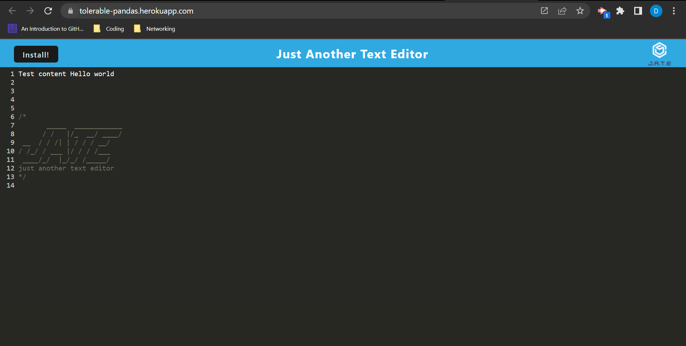

# tolerable_pandas

## Description
A Progressive Web Application used for creating and storing notes and code snippets, even when used offline.

## Motivation
To have a resource for keeping notes for later use, which can be retrieved without an internet connection.

## Usage
Click on the Deployed Site link to gain access to the application in the browser. Enter text to be saved. Click the "Install" button in the upper right corner to download this text editor to your desktop.

## Screenshots

## Deployed Site
[Heroku deployed application](https://tolerable-pandas.herokuapp.com/)

## Lisence
Refer to MIT Lisence in repo.